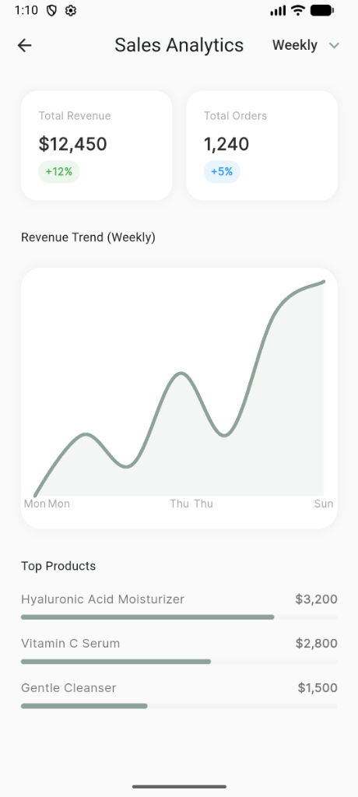
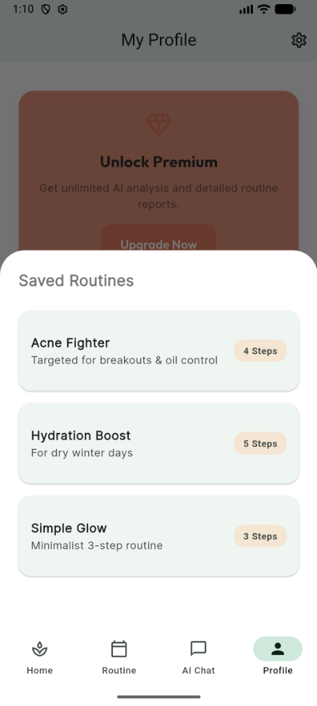
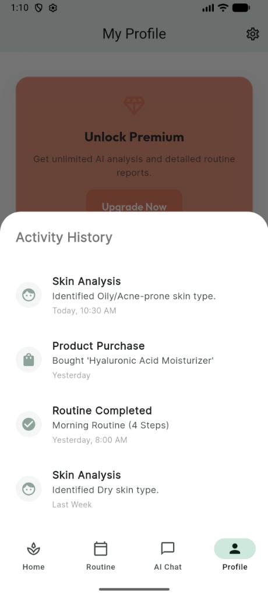
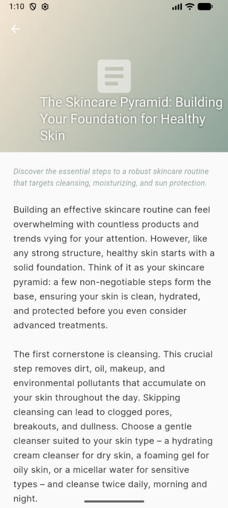
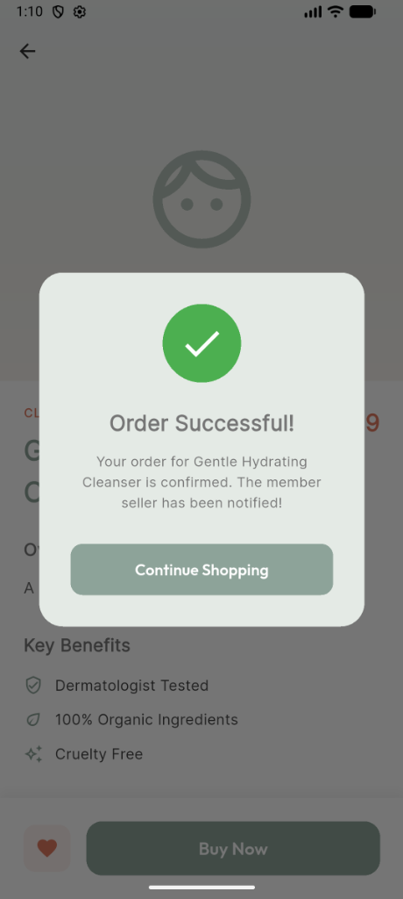

# SkinCare AI

A comprehensive AI-powered skincare companion app built with Flutter.

## Features

*   **AI Skin Analysis Quiz**: Determine skin type and concerns.
*   **Personalized Routines**: AI-generated morning and evening routines.
*   **AI Chat Consultant**: Ask questions to a virtual dermatologist.
*   **Skin Store**: Curated products with simulated checkout.
*   **Educational Blog**: AI-generated skincare articles.
*   **Seller Tools**: Sales analytics and product management.

## Screenshots

| Sales Analytics | Profile & Premium |
|:---:|:---:|
|  |  |

| Activity History | Blog Post | Order Success |
|:---:|:---:|:---:|
|  |  |  |

## Technologies

*   **Flutter & Dart**
*   **Google Gemini API** (AI Integration)
*   **Riverpod** (State Management)
*   **GoRouter** (Navigation)
*   **FL Chart** (Analytics)
